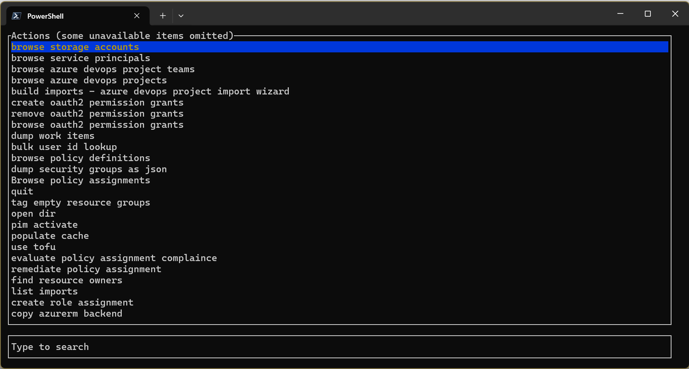

<div align="center">
    <h1>☁🐘 Nuage Terrastodon</h1>
    
    <br/>

 [](https://deepwiki.com/AAFC-Cloud/Cloud-Terrastodon)

[Voir la version anglaise](./README.md)

</div>


## Description

Un outil en ligne de commande (CLI) et un SDK pour interagir avec Azure et Terraform.

[Vidéo de démonstration lors de l'appel communautaire Azure Terraform de septembre 2024](https://youtu.be/HtLdT7TZwOI?t=701)

Voir également : https://github.com/Azure/aztfexport

## Installation

Téléchargez la dernière version depuis la [page des publications GitHub](https://github.com/AAFC-Cloud/Cloud-Terrastodon/releases)

## Utilisation

Par défaut, l'application ne prend aucun argument et démarre une interface utilisateur de terminal interactive.



Les commandes les plus utiles sont « pim activate » et celles commençant par « browse ... ».

## Mise en cache

Notez que Cloud Terrastodon utilise une stratégie de mise en cache pour éviter de récupérer à nouveau certaines informations, ce qui réduit le temps d'exécution des actions consécutives. Toutefois, ce cache peut parfois devenir obsolète avant la fenêtre d'expiration automatique.

Vous pouvez exécuter

```pwsh
cloud_terrastodon clean
```

pour purger le cache.

## Développement

### Dépendances

- [Azure CLI `az`](https://learn.microsoft.com/en-us/cli/azure/install-azure-cli#install)

### Configuration de votre environnement de développement

Installez le SDK Windows et les outils de développement Visual Studio

- https://developer.microsoft.com/en-us/windows/downloads/windows-sdk/
- https://visualstudio.microsoft.com/visual-cpp-build-tools/
    - [x] Développement d'applications de bureau en C++

## Droits d’auteur

Droits d’auteur appartiennent à © Sa Majesté le Roi du chef du Canada, qui est représenté par le ministre de l’Agriculture et de l’Agroalimentaire, 2025