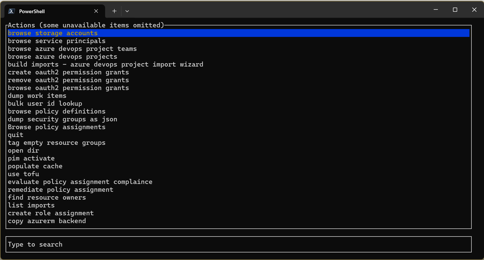

<div align="center">
    <h1>☁🐘 Cloud Terrastodon</h1>
    
    <br/>


[Voir la version française](./README.fr_ca.md)

</div>


## Description

A CLI tool and SDK for interacting with Azure and Terraform.

[Video demonstration from Azure Terraform September 2024 Community Call](https://youtu.be/HtLdT7TZwOI?t=701)

See also: https://github.com/Azure/aztfexport

## Installation

Grab the latest version from the [GitHub releases page](https://github.com/AAFC-Cloud/Cloud-Terrastodon/releases)

## Usage

By defauilt, the app takes no arguments and enters an interactive terminal user interface.



The most helpful commands are "pim activate" and the "browse ..." ones.

## Caching

Note that Cloud Terrastodon uses a caching strategy to avoid refetching information, reducing the time it takes for consecutive actions. However, this cache can sometimes get out of date before the automatic expiry window.

You can run

```pwsh
cloud_terrastodon clean
```

to purge the cache.

## Development

### Dependencies

- [Azure CLI `az`](https://learn.microsoft.com/en-us/cli/azure/install-azure-cli#install)

### Setting up your development environment

Install the windows sdk and visual studio dev tools

- https://developer.microsoft.com/en-us/windows/downloads/windows-sdk/
- https://visualstudio.microsoft.com/visual-cpp-build-tools/
    - [x] Desktop development with C++


## Copyright

Copyright belongs to © His Majesty the King in Right of Canada, as represented by the Minister of Agriculture and Agri-Food, 2025.
