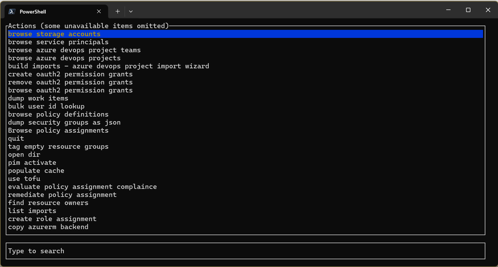

<div align="center">
    <h1>☁🐘 Cloud Terrastodon</h1>
    
    <br/>


 [](https://deepwiki.com/AAFC-Cloud/Cloud-Terrastodon)


[Voir la version française](./README.fr_ca.md)

</div>


## Description

A CLI tool and SDK for interacting with Azure and Terraform.

[Video demonstration from Azure Terraform September 2024 Community Call](https://youtu.be/HtLdT7TZwOI?t=701)

See also: https://github.com/Azure/aztfexport

## Installation

Grab the latest version from the [GitHub releases page](https://github.com/AAFC-Cloud/Cloud-Terrastodon/releases)

## Usage

By defauilt, the app takes no arguments and enters an interactive terminal user interface.



The most helpful commands are "pim activate" and the "browse ..." ones.

`cloud_terrastodon az subscription list` lists subscriptions grouped by tracked
tenant, with tenant IDs, names, aliases, and links to subscriptions in the Azure
portal. Tenants with unavailable authentication appear with an error while other
tenants continue. Use `--tenant <ID|ALIAS>` to query one tenant.

Subscription output defaults to coloured text in a terminal and JSON when stdout
is redirected, including PowerShell pipelines. Override this with the global
`--output-format text` or `--output-format json` flag:

```pwsh
cloud_terrastodon az subscription list
cloud_terrastodon az subscription list --tenant agr --output-format json
cloud_terrastodon az subscription list --output-format facet-pretty
$tenants = cloud_terrastodon az subscription list | ConvertFrom-Json
$tenants.subscriptions
```

Use `--output-format facet-pretty` to inspect the underlying tenant and
subscription data with Facet's pretty printer.

## Caching

Note that Cloud Terrastodon uses a caching strategy to avoid refetching information, reducing the time it takes for consecutive actions. However, this cache can sometimes get out of date before the automatic expiry window.

You can run

```pwsh
cloud_terrastodon clean
```

to purge the cache.

## Development

For a small CLI with your own arguments and subcommands, see
[Reusable applications](docs/REUSABLE_APPLICATIONS.md) and the independently tested
[single-file consumer example](examples/standalone-cli).

### Dependencies

- [Azure CLI `az`](https://learn.microsoft.com/en-us/cli/azure/install-azure-cli#install)

### Setting up your development environment

Install the windows sdk and visual studio dev tools

- https://developer.microsoft.com/en-us/windows/downloads/windows-sdk/
- https://visualstudio.microsoft.com/visual-cpp-build-tools/
    - [x] Desktop development with C++


### Tracy profiling

Install `teamy-profiler` from the profiler repository and ensure
`tracy-capture.exe` is available on `PATH`:

```pwsh
cargo install --path C:\path\to\teamy-profiler --locked
```

Run the default resource-list capture or provide another Cloud Terrastodon
command:

```pwsh
.\run-profiler.ps1
.\run-profiler.ps1 az resource list
```

The wrapper writes the Tracy capture, target logs, top-span CSV, and run
manifest under `tracy/`. Open the `.tracy` file in Tracy Profiler or
summarize it with `teamy-profiler tracy csv export`.

## Copyright

Copyright belongs to © His Majesty the King in Right of Canada, as represented by the Minister of Agriculture and Agri-Food, 2025.
